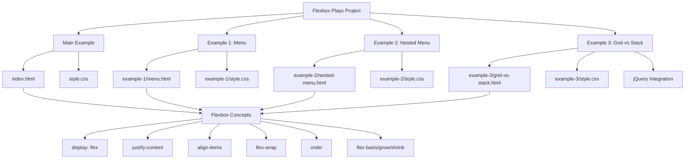

# Flexbox Plays

A collection of CSS Flexbox examples and demonstrations for learning and experimenting with modern CSS layout techniques.

Built in November 2018. This project provides hands-on examples of CSS Flexbox properties and patterns, including responsive navigation menus, nested flex containers, and interactive layout toggles.

## Features

- 📦 Basic flexbox ordering and alignment examples
- 📱 Responsive navigation menu with mobile-first approach
- 🔗 Nested flexbox containers with multiple menus
- 🎛️ Interactive grid vs stack layout toggle
- 💡 Clean, well-commented code for learning
- 🌐 No build process - pure HTML/CSS
- ✅ Cross-browser compatible (modern browsers)

## Getting Started

### Prerequisites

- A modern web browser (Chrome, Firefox, Safari, or Edge)
- No dependencies or build tools required

### Installation

1. Clone the repository:
```bash
git clone https://github.com/orassayag/flexbox-plays.git
cd flexbox-plays
```

2. Open any HTML file in your browser:
```bash
# Open main example
open index.html
# or
open example-1/menu.html
```

No installation, build, or compilation needed - just open and explore!

## Examples

### Main Example - Flexbox Ordering
**File:** `index.html`

Demonstrates basic flexbox ordering with numbered blocks that display in a custom order using the `order` property.

```
┌───┬───┬───┬───┐
│ 2 │ 1 │ 4 │ 3 │
└───┴───┴───┴───┘
```

**Key Concepts:**
- `display: flex`
- `order` property
- `justify-content: space-between`
- Fixed flex basis

### Example 1 - Responsive Menu
**File:** `example-1/menu.html`

A responsive navigation menu that stacks vertically on mobile and displays horizontally on desktop.

**Mobile:**
```
┌─────────┐
│  Home   │
├─────────┤
│  About  │
├─────────┤
│  Store  │
├─────────┤
│ Contact │
└─────────┘
```

**Desktop (≥768px):**
```
┌──────┬──────┬──────┬─────────┐
│ Home │ About│ Store│ Contact │
└──────┴──────┴──────┴─────────┘
```

**Key Concepts:**
- Media queries
- Mobile-first responsive design
- Equal width flex items
- Hover effects

### Example 2 - Nested Menu
**File:** `example-2/nested-menu.html`

Navigation with main menu and social media links using nested flex containers.

```
┌──────┬──────┬──────┬─────────┬──────────┬─────────┐
│ Home │ About│ Store│ Contact │ Facebook │ Twitter │
└──────┴──────┴──────┴─────────┴──────────┴─────────┘
```

**Key Concepts:**
- Nested flexbox containers
- Multiple flex rows
- `space-between` alignment
- Responsive social links

### Example 3 - Grid vs Stack Toggle
**File:** `example-3/grid-vs-stack.html`

Interactive example with a toggle button to switch between grid and stacked article layouts.

**Grid Layout:**
```
┌─────────┬─────────┬─────────┐
│Article 1│Article 2│Article 3│
├─────────┼─────────┼─────────┤
│Article 4│Article 5│Article 6│
└─────────┴─────────┴─────────┘
```

**Stack Layout:**
```
┌───────────────────────────────┐
│         Article 1             │
├───────────────────────────────┤
│         Article 2             │
├───────────────────────────────┤
│         Article 3             │
└───────────────────────────────┘
```

**Key Concepts:**
- `flex-wrap: wrap`
- Dynamic class toggling
- Article grid layout
- jQuery integration
- Flexible article cards

## Architecture



## Project Structure

```
flexbox-plays/
├── index.html              # Basic flexbox ordering
├── style.css               # Main example styles
├── example-1/              # Responsive menu
│   ├── menu.html
│   └── style.css
├── example-2/              # Nested menu
│   ├── nested-menu.html
│   └── style.css
├── example-3/              # Grid vs Stack
│   ├── grid-vs-stack.html
│   └── style.css
├── README.md               # This file
├── CONTRIBUTING.md         # Contribution guidelines
├── INSTRUCTIONS.md         # Detailed usage instructions
└── LICENSE                 # MIT license
```

## Flexbox Properties Reference

### Container Properties
| Property | Description | Values |
|----------|-------------|--------|
| `display` | Defines flex container | `flex`, `inline-flex` |
| `flex-direction` | Main axis direction | `row`, `column`, `row-reverse`, `column-reverse` |
| `justify-content` | Main axis alignment | `flex-start`, `flex-end`, `center`, `space-between`, `space-around` |
| `align-items` | Cross axis alignment | `flex-start`, `flex-end`, `center`, `stretch`, `baseline` |
| `flex-wrap` | Item wrapping | `nowrap`, `wrap`, `wrap-reverse` |

### Item Properties
| Property | Description | Values |
|----------|-------------|--------|
| `flex` | Shorthand for grow/shrink/basis | `<grow> <shrink> <basis>` |
| `order` | Display order | `<integer>` |
| `align-self` | Individual cross axis alignment | `auto`, `flex-start`, `flex-end`, `center`, `baseline`, `stretch` |

## Browser Support

- ✅ Chrome (29+)
- ✅ Firefox (28+)
- ✅ Safari (9+)
- ✅ Edge (12+)
- ⚠️ IE 11 (with prefixes)

## Learning Resources

- [MDN Flexbox Guide](https://developer.mozilla.org/en-US/docs/Web/CSS/CSS_Flexible_Box_Layout)
- [CSS Tricks Complete Guide to Flexbox](https://css-tricks.com/snippets/css/a-guide-to-flexbox/)
- [Flexbox Froggy Game](https://flexboxfroggy.com/)
- [Flexbox Defense Game](http://www.flexboxdefense.com/)

## Contributing

Contributions to this project are [released](https://help.github.com/articles/github-terms-of-service/#6-contributions-under-repository-license) to the public under the [project's open source license](LICENSE).

Everyone is welcome to contribute. Contributing doesn't just mean submitting pull requests—there are many different ways to get involved, including answering questions and reporting issues.

Please see [CONTRIBUTING.md](CONTRIBUTING.md) for detailed contribution guidelines.

## Author

* **Or Assayag** - *Initial work* - [orassayag](https://github.com/orassayag)
* Or Assayag <orassayag@gmail.com>
* GitHub: https://github.com/orassayag
* StackOverflow: https://stackoverflow.com/users/4442606/or-assayag?tab=profile
* LinkedIn: https://linkedin.com/in/orassayag

## License

This application has an MIT license - see the [LICENSE](LICENSE) file for details.
