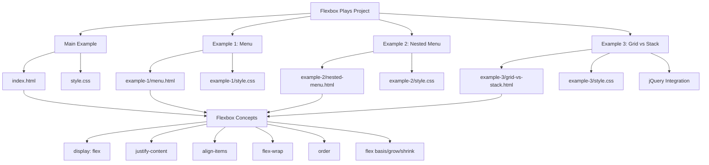

# Flexbox Plays

A collection of CSS Flexbox examples and demonstrations for learning and experimenting with modern CSS layout techniques.

Built in November 2018. This project provides hands-on examples of CSS Flexbox properties and patterns, including responsive navigation menus, nested flex containers, and interactive layout toggles.

## Features

### Core Capabilities

- **Flexible Ordering**: Dynamically reorder elements without changing HTML structure.
- **Responsive Navigation**: Create menus that adapt seamlessly to mobile and desktop.
- **Nested Containers**: Manage complex layouts with nested flexbox rows and columns.
- **Dynamic Layouts**: Switch between different layout modes (grid vs stack) using simple class toggles.
- 📦 Basic flexbox ordering and alignment examples
- 📱 Responsive navigation menu with mobile-first approach
- 🔗 Nested flexbox containers with multiple menus
- 🎛️ Interactive grid vs stack layout toggle
- 💡 Clean, well-commented code for learning
- 🌐 No build process - pure HTML/CSS
- ✅ Cross-browser compatible (modern browsers)

### Technical Excellence

- **W3C Standards**: Following official CSS Flexible Box Layout Module specifications.
- **Performance**: Extremely lightweight with no external libraries (except for jQuery in Example 3).
- **Cross-Browser**: Tested for consistency across modern rendering engines.
- **Clean Code**: Well-organized and commented CSS properties for educational purposes.

### Developer Experience

- **Instant Feedback**: Changes to CSS are immediately visible in the browser.
- **No Toolchain**: No need for Node.js (except for script shortcuts), pnpm, or complex build processes.
- **Well-Commented Code**: Every example includes comments explaining the flexbox properties used.
- **Pure HTML/CSS**: Learn the fundamentals without the abstraction of frameworks.

## Getting Started

### Prerequisites

- A modern web browser (Chrome, Firefox, Safari, or Edge)
- No dependencies or build tools required

### Installation

1. Clone the repository:

```bash
git clone https://github.com/orassayag/flexbox-plays.git
cd flexbox-plays
```

2. Open any HTML file in your browser:

```bash
# Open main example
open index.html
# or
open example-1/menu.html
```

No installation, build, or compilation needed - just open and explore!

## Configuration

### Browser Compatibility

This project is optimized for modern web browsers. No special configuration is required, but ensure you are using a recent version of:

- Google Chrome
- Mozilla Firefox
- Apple Safari
- Microsoft Edge

### Recommended Tools

For the best development experience:

- **VS Code**: Recommended editor for viewing and editing code.
- **Live Server Extension**: Use this in VS Code for instant browser refreshes as you edit CSS.

## Usage

### Exploration

1. Open any HTML file from the project root or example directories.
2. Observe the layout and resize your browser window to see responsive behavior.
3. Inspect the elements using Browser DevTools (F12) to see Flexbox properties in action.

### Modification

1. Open the corresponding `style.css` for any example.
2. Experiment by changing flex properties like `justify-content`, `align-items`, or `flex-direction`.
3. Save the file and refresh your browser to see the impact.

## Available Scripts

While this project is pure HTML/CSS, some convenience scripts are provided via `package.json`:

```bash
# Open main example
npm run start

# Open Example 1: Responsive Menu
npm run open:example1

# Open Example 2: Nested Menu
npm run open:example2

# Open Example 3: Grid vs Stack Toggle
npm run open:example3
```

## Examples

### Main Example - Flexbox Ordering

**File:** `index.html`

Demonstrates basic flexbox ordering with numbered blocks that display in a custom order using the `order` property.

```
┌───┬───┬───┬───┐
│ 2 │ 1 │ 4 │ 3 │
└───┴───┴───┴───┘
```

**Key Concepts:**

- `display: flex`
- `order` property
- `justify-content: space-between`
- Fixed flex basis

### Example 1 - Responsive Menu

**File:** `example-1/menu.html`

A responsive navigation menu that stacks vertically on mobile and displays horizontally on desktop.

**Mobile:**

```
┌─────────┐
│  Home   │
├─────────┤
│  About  │
├─────────┤
│  Store  │
├─────────┤
│ Contact │
└─────────┘
```

**Desktop (≥768px):**

```
┌──────┬──────┬──────┬─────────┐
│ Home │ About│ Store│ Contact │
└──────┴──────┴──────┴─────────┘
```

**Key Concepts:**

- Media queries
- Mobile-first responsive design
- Equal width flex items
- Hover effects

### Example 2 - Nested Menu

**File:** `example-2/nested-menu.html`

Navigation with main menu and social media links using nested flex containers.

```
┌──────┬──────┬──────┬─────────┬──────────┬─────────┐
│ Home │ About│ Store│ Contact │ Facebook │ Twitter │
└──────┴──────┴──────┴─────────┴──────────┴─────────┘
```

**Key Concepts:**

- Nested flexbox containers
- Multiple flex rows
- `space-between` alignment
- Responsive social links

### Example 3 - Grid vs Stack Toggle

**File:** `example-3/grid-vs-stack.html`

Interactive example with a toggle button to switch between grid and stacked article layouts.

**Grid Layout:**

```
┌─────────┬─────────┬─────────┐
│Article 1│Article 2│Article 3│
├─────────┼─────────┼─────────┤
│Article 4│Article 5│Article 6│
└─────────┴─────────┴─────────┘
```

**Stack Layout:**

```
┌───────────────────────────────┐
│         Article 1             │
├───────────────────────────────┤
│         Article 2             │
├───────────────────────────────┤
│         Article 3             │
└───────────────────────────────┘
```

**Key Concepts:**

- `flex-wrap: wrap`
- Dynamic class toggling
- Article grid layout
- jQuery integration
- Flexible article cards

## Development

### Architecture Principles

- **Modular Examples**: Each example is self-contained in its own directory with dedicated HTML and CSS.
- **No-Build Philosophy**: Zero dependencies, zero build tools, zero complexity.
- **Semantic HTML**: Prioritizing accessibility and proper document structure.
- **Responsive-First**: Layouts are designed to work on all screen sizes using CSS media queries.
- **Separation of Concerns**: Keeping structure (HTML) and style (CSS) strictly separated.

### Adding New Examples

1. Create a new directory (e.g., `example-4/`).
2. Add an `index.html` and `style.css` file.
3. Link the new example in the main `README.md` and `index.html`.

## Architecture


```mermaid
graph TD
    A[Flexbox Plays Project] --> B[Main Example]
    A --> C[Example 1: Menu]
    A --> D[Example 2: Nested Menu]
    A --> E[Example 3: Grid vs Stack]

    B --> B1[index.html]
    B --> B2[style.css]

    C --> C1[example-1/menu.html]
    C --> C2[example-1/style.css]

    D --> D1[example-2/nested-menu.html]
    D --> D2[example-2/style.css]

    E --> E1[example-3/grid-vs-stack.html]
    E --> E2[example-3/style.css]
    E --> E3[jQuery Integration]

    B1 --> F[Flexbox Concepts]
    C1 --> F
    D1 --> F
    E1 --> F

    F --> F1[display: flex]
    F --> F2[justify-content]
    F --> F3[align-items]
    F --> F4[flex-wrap]
    F --> F5[order]
    F --> F6[flex basis/grow/shrink]
```

## Project Structure

### Directory Structure

```
flexbox-plays/
├── index.html              # Basic flexbox ordering
├── style.css               # Main example styles
├── example-1/              # Responsive menu
│   ├── menu.html
│   └── style.css
├── example-2/              # Nested menu
│   ├── nested-menu.html
│   └── style.css
├── example-3/              # Grid vs Stack layout toggle
│   ├── grid-vs-stack.html
│   └── style.css
├── package.json            # Script shortcuts
└── README.md               # Project documentation
```

## Design Patterns

### Common Flexbox Patterns

- **Holy Grail Layout**: Using flexbox to manage headers, footers, and sidebars efficiently.
- **Media Objects**: Aligning images and text content flexibly for comments or list items.
- **Centering Patterns**: Standard techniques for perfect horizontal and vertical centering.
- **Sticky Footers**: Ensuring the footer stays at the bottom of the page regardless of content length.

## Best Practices

- **Use Flex Basis**: Prefer `flex-basis` over `width` for flexible layouts to allow better item resizing.
- **Mobile First**: Define mobile styles first and use `min-width` media queries for desktop enhancements.
- **Consistent Naming**: Use descriptive class names that reflect purpose (e.g., `.nav-item`) rather than appearance.
- **Avoid Over-nesting**: Keep the DOM structure as flat as possible to simplify flexbox calculations and maintenance.
- **Browser Testing**: Always verify layouts in multiple modern browsers to ensure consistent rendering.

```

## Flexbox Properties Reference

### Container Properties

| Property          | Description            | Values                                                              |
| ----------------- | ---------------------- | ------------------------------------------------------------------- |
| `display`         | Defines flex container | `flex`, `inline-flex`                                               |
| `flex-direction`  | Main axis direction    | `row`, `column`, `row-reverse`, `column-reverse`                    |
| `justify-content` | Main axis alignment    | `flex-start`, `flex-end`, `center`, `space-between`, `space-around` |
| `align-items`     | Cross axis alignment   | `flex-start`, `flex-end`, `center`, `stretch`, `baseline`           |
| `flex-wrap`       | Item wrapping          | `nowrap`, `wrap`, `wrap-reverse`                                    |

### Item Properties

| Property     | Description                     | Values                                                            |
| ------------ | ------------------------------- | ----------------------------------------------------------------- |
| `flex`       | Shorthand for grow/shrink/basis | `<grow> <shrink> <basis>`                                         |
| `order`      | Display order                   | `<integer>`                                                       |
| `align-self` | Individual cross axis alignment | `auto`, `flex-start`, `flex-end`, `center`, `baseline`, `stretch` |

## Browser Support

- ✅ Chrome (29+)
- ✅ Firefox (28+)
- ✅ Safari (9+)
- ✅ Edge (12+)
- ⚠️ IE 11 (with prefixes)

## Learning Resources

- [MDN Flexbox Guide](https://developer.mozilla.org/en-US/docs/Web/CSS/CSS_Flexible_Box_Layout)
- [CSS Tricks Complete Guide to Flexbox](https://css-tricks.com/snippets/css/a-guide-to-flexbox/)
- [Flexbox Froggy Game](https://flexboxfroggy.com/)
- [Flexbox Defense Game](http://www.flexboxdefense.com/)

## Contributing

Contributions to this project are [released](https://help.github.com/articles/github-terms-of-service/#6-contributions-under-repository-license) to the public under the [project's open source license](LICENSE).

Everyone is welcome to contribute. Contributing doesn't just mean submitting pull requests—there are many different ways to get involved, including answering questions and reporting issues.

Please see [CONTRIBUTING.md](CONTRIBUTING.md) for detailed contribution guidelines.

## Author

- **Or Assayag** - _Initial work_ - [orassayag](https://github.com/orassayag)
- Or Assayag <orassayag@gmail.com>
- GitHub: https://github.com/orassayag
- StackOverflow: https://stackoverflow.com/users/4442606/or-assayag?tab=profile
- LinkedIn: https://linkedin.com/in/orassayag

## License

This application has an MIT license - see the [LICENSE](LICENSE) file for details.

## Acknowledgments

- Built for educational and research purposes
- Respects robots.txt and implements rate limiting
- Uses user-agent rotation to avoid detection
- Implements polite crawling practices
```
